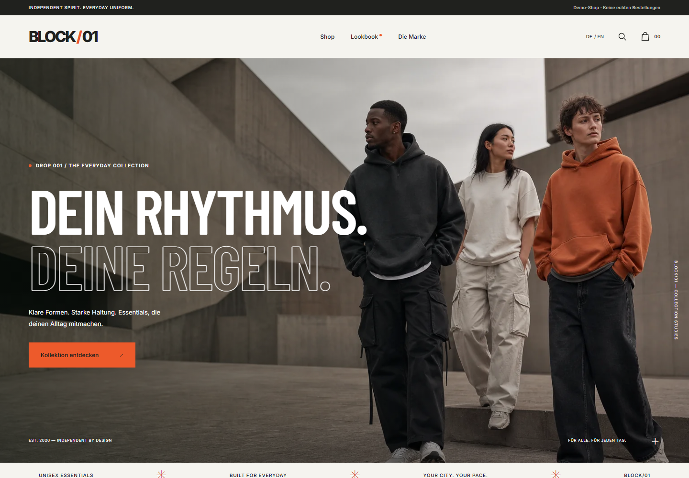
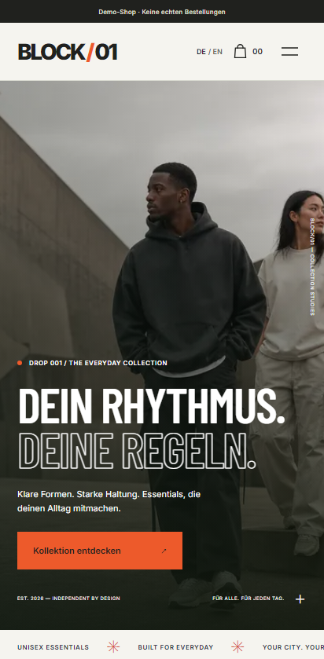

# BLOCK/01 — Urban Streetwear Demo

Ein zweisprachiger Online-Shop als Design- und Frontend-Arbeitsprobe von [Tracht Digital Solutions](https://tracht-digital.de). BLOCK/01 ist eine fiktive Streetwear-Marke: klare Typografie, großzügige Produktbilder, warme Neutraltöne und Signalorange.

**Dies ist ein Beispiel-Shop.** Produkte, Preise und Bestände sind Demonstrationsdaten. Der Checkout simuliert einen Kauf; es entstehen keine Bestellungen, Zahlungen oder Lieferungen. Die Demo bleibt auch im Release eine Demo.



## Shop erkunden

- Deutsch und Englisch unter `/de/` und `/en/`; `/` führt zur deutschen Startseite.
- 16 Beispielprodukte mit Suche, Filtern und Sortierung sowie Produktseiten mit Größenwahl, Verfügbarkeit und Produktinformationen.
- Produktgalerie mit Swipe-Bildwechsel, Mauslupe und verschiebbarer Vollbildvergrößerung; einschiebende Warenkorbartikel, Hover-Inhalte und Akkordeons.
- Warenkorb mit Mengenänderung und transparenten Summen; Speicherung ausschließlich im Browser.
- Simulierter Gast-Checkout mit Bestätigungsansicht, ohne Zahlungsdienst oder Shop-Backend.
- Responsive Layouts für Mobilgeräte, Tablet und Desktop; Bedienbarkeit mit der Tastatur und reduzierte Bewegung werden berücksichtigt.



## Lokal starten

Voraussetzungen: Node.js **24** und npm. Alle Abhängigkeiten kommen aus der öffentlichen npm-Registry; Zugangsdaten werden für den Build nicht benötigt.

```sh
npm ci
npm run dev
```

Die lokale Vorschau läuft unter [localhost:4321/de/](http://localhost:4321/de/).

```sh
npm run type-check
npm run test:run
npm run build
npx playwright install chromium
npm run test:e2e
```

Für Linux-Umgebungen installiert `npx playwright install --with-deps chromium` zusätzlich die Browser-Systembibliotheken. Die Tests verwenden die Playwright-Konfiguration des Projekts. Die aufgeführten Befehle sind die Prüfstrecke; der aktuelle Ergebnisstatus ist im jeweiligen [Actions-Lauf](https://github.com/Tracht-Digital-Solutions/beispiel-shop/actions) sichtbar.

## Technik und Übergabe

Astro erzeugt statische HTML-Seiten. React übernimmt die interaktiven Shopfunktionen. TypeScript, Vitest und Playwright bilden die Prüfstrecke. Die fertige Website liegt nach dem Build in `dist/`; auf dem Webserver wird keine Node-Laufzeit benötigt.

Die Pipelines folgen dem Muster der bestehenden TDS-Frontends:

| Ablauf                                | Auslöser                                 | Ergebnis                                                                |
| ------------------------------------- | ---------------------------------------- | ----------------------------------------------------------------------- |
| **CI**                                | Pull Request nach `main`                 | Typprüfung, Tests, Build und Browserprüfung; keine Veröffentlichung     |
| **Dev build → dev branch**            | Push nach `main` oder manuell auf `main` | Geprüfter statischer Build auf `dev`; keine Deployment-Benachrichtigung |
| **Release → release branch (manual)** | Manuell auf `main`                       | Neuer geprüfter Build auf `release`; optionaler Deployment-Webhook      |

`main` enthält den Quellcode. `dev` und `release` enthalten ausschließlich den jeweils neuesten gebauten Stand als verwaiste Artefaktbranches. Der Release-Workflow baut `main` neu; er übernimmt nicht den vorhandenen `dev`-Stand. Ein Push nach `main` löst keinen Release aus.

Deployment und Domain-Konfiguration übernimmt der Betreiber. Einrichtung, optionale Variablen und Webhook-Verhalten stehen in [INSTALL.md](INSTALL.md). Entscheidungen und Quellen sind in [docs/RESEARCH.md](docs/RESEARCH.md) dokumentiert; Bildnachweise in [docs/IMAGE-SOURCES.md](docs/IMAGE-SOURCES.md).

Die dokumentierten Prüfergebnisse stehen in [docs/VALIDATION.md](docs/VALIDATION.md). Screenshots und lokale Performance-Messungen lassen sich bei laufender Produktionsvorschau mit `npm run screenshots` und `npm run audit:performance` erneuern. Schriften und Lizenzhinweise sind unter [docs/THIRD-PARTY-NOTICES.md](docs/THIRD-PARTY-NOTICES.md) dokumentiert.

## English

BLOCK/01 is a fictional, bilingual streetwear shop built as a frontend portfolio sample by Tracht Digital Solutions. Browse the English shop at `/en/`. Checkout is simulated: no payments, real orders or deliveries. Run `npm ci` and `npm run dev` with Node.js 24. The production build is static and requires no application server.
